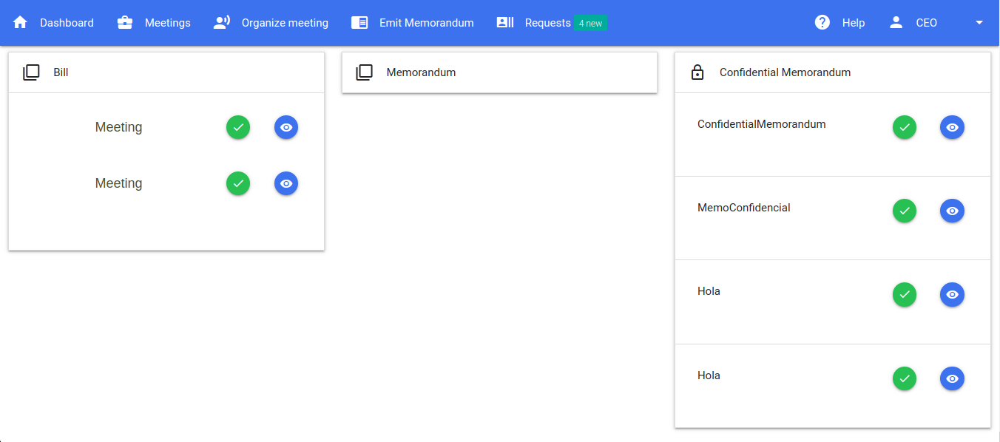

# Digital Office project
We have developed a web system that allows the users to  generate the different types of documents listed in the requirements section (i.e. minutes, memorandums and private memorandums), to sign each document related to the meeting that they had attended previously and to be able to have a register of all the documents, and meetings, that the worker/employee has signed, or has been given permission to check, through their history as users of this system. 
        
We strongly feel that a multi-level web application using specific cryptographic notions, like digital signature, will be part of the solution that we can use to develop a great system that fulfills all the requirements.
        
##  Technologies
1. Client side: HTML, CSS, Javascript, JQuery.
2. Server side: Python, Flask, Mysql
            
## Index

## Login

## Dashboard

## Meetings

## Generate keys

## See request

## Register

## Write a memorandom

## See a memorandum

